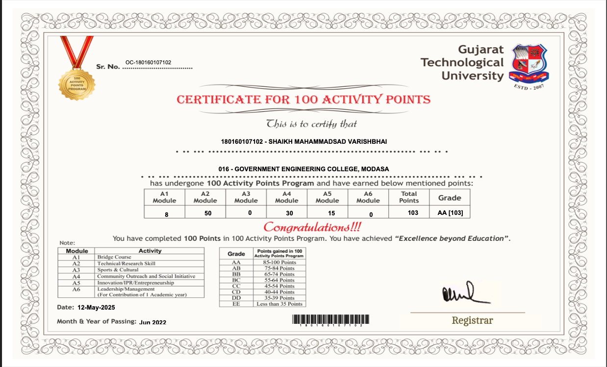

<!DOCTYPE html>
<html lang="en">
<head>
  <meta charset="UTF-8" />
  <meta name="viewport" content="width=device-width, initial-scale=1" />
</head>
<body>
    <h1>100 Activity Points Program</h1>
   

</body>
</html>
